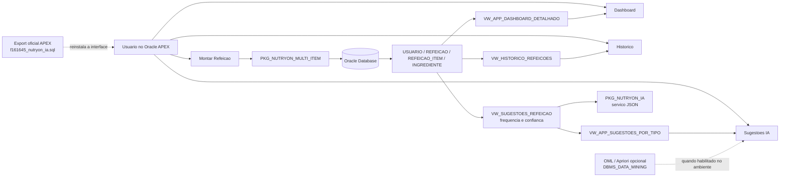

# Nutryon AI - Inteligencia Artificial integrada ao Oracle APEX

Componente de Inteligencia Artificial do projeto **Nutryon**, desenvolvido para a disciplina **Disruptive Architectures: IoT, IoB & Generative IA** da FIAP.

Este repositorio evolui a entrega anterior, que era baseada principalmente em scripts SQL e relatorios APEX, para uma versao mais funcional: o usuario consegue montar refeicoes com multiplos alimentos, acompanhar o dashboard de calorias/macronutrientes e consultar sugestoes de alimentos por tipo de refeicao usando uma camada de IA baseada no historico alimentar.

---

## Integrantes

| Nome | RM |
|---|---|
| Renato | RM560928 |
| Victor | RM560087 |
| Luan Noqueli Klochko | RM560313 |
| Lucas Higuti Fontanezi | RM561120 |

---

## Sobre o projeto

O **Nutryon** e um aplicativo de nutricao e controle de macronutrientes. A proposta e permitir que o usuario registre refeicoes diarias, acompanhe calorias, proteinas, carboidratos e gorduras, e receba sugestoes inteligentes de alimentos com base nos padroes do historico de refeicoes.

Nesta entrega, o foco esta em:

- Implementar o modelo de IA definido na entrega anterior.
- Criar um mecanismo consumivel pelo Oracle APEX.
- Integrar a IA ao app APEX.
- Permitir testes reais de cadastro de refeicao e atualizacao de dashboard.
- Documentar tecnicamente o fluxo para entrega e video-pitch.

---

## Problema de IA resolvido

Um dos maiores pontos de abandono em aplicativos de nutricao e o registro manual repetitivo das refeicoes. O usuario precisa procurar alimento por alimento, informar quantidades e repetir esse processo todos os dias.

A IA do Nutryon reduz essa friccao aprendendo padroes do historico. Exemplo: se usuarios registram frequentemente **arroz**, **feijao** e **frango** no almoco, o sistema passa a sugerir esses alimentos quando o tipo de refeicao selecionado for **ALMOCO**.

---

## Modelo utilizado

| Item | Descricao |
|---|---|
| Abordagem principal | Regras de associacao por tipo de refeicao |
| Algoritmo planejado | Apriori / Association Rules |
| Pacote Oracle | `DBMS_DATA_MINING` |
| Modelo OML | `MDL_NUTRYON_ASSOC` |
| Fallback funcional | Views SQL analiticas consumidas pelo APEX |

### Metricas configuradas para OML

| Metrica | Valor | Significado |
|---|---:|---|
| Suporte minimo | 10% | Ingrediente aparece em pelo menos 10% das transacoes |
| Confianca minima | 60% | Probabilidade minima da associacao |
| Lift | > 1 | Associacao mais forte que coincidencia estatistica |

> Observacao: o script OML esta preparado em `apex/nutryon_oml.sql`, mas depende de o schema Oracle liberar `DBMS_DATA_MINING`. Para garantir demonstracao funcional no APEX, tambem foi implementado um fallback SQL baseado em frequencia/confianca por tipo de refeicao.

---

## Arquitetura atual da solucao



A aplicacao atualmente consome views SQL funcionais diretamente no APEX. O treinamento OML/Apriori permanece preparado para ambientes que disponibilizem `DBMS_DATA_MINING`, enquanto o servico JSON registra o mecanismo de integracao consumivel pelo APEX.

---

## Comparacao com a versao anterior

| Ponto | Versao anterior no GitHub | Versao atual preparada para entrega |
|---|---|---|
| Interface APEX | Tres paginas de Interactive Report | Fluxo de app com Dashboard, Montar Refeicao, Sugestoes IA e Historico |
| Sugestoes IA | View simples de sugestoes por frequencia | Sugestoes filtradas por tipo de refeicao, cards no APEX e servico JSON |
| Cadastro de refeicao | Nao havia fluxo de montagem completo no APEX | Usuario cria refeicao, adiciona multiplos alimentos, remove itens e finaliza |
| Catalogo de alimentos | Poucos alimentos base | Catalogo expandido com cereais, frutas, proteinas, laticinios, vegetais e bebidas |
| Integracao APEX | Principalmente views | Packages PL/SQL, LOVs, processos APEX, views de apoio e export do app |
| Evidencias e documentacao | README focado no MVP | Guia funcional, diagrama atualizado no README e export oficial do app APEX |

---

## Estrutura do repositorio

```text
Nutryon_IOT_Sprint_3/
|-- README.md
|-- sql/
|   |-- nutryon_mvp.sql
|   |-- sprint3.sql
|   `-- dados_treinamento_ia.sql
|-- apex/
|   |-- nutryon_oml.sql
|   |-- nutryon_ai_service.sql
|   |-- nutryon_app_runtime.sql
|   `-- f161645_nutryon_ia.sql
`-- docs/
    |-- Diagrama AI.png
    `-- apex_app_funcional_setup.md
```

O arquivo `docs/Diagrama AI.png` e um artefato historico da Sprint 3. O diagrama da arquitetura atual desta entrega esta documentado em Mermaid neste README.

---

## Scripts principais

| Arquivo | Funcao |
|---|---|
| `sql/nutryon_mvp.sql` | Cria tabelas, dados base e views iniciais para Dashboard, Historico e Sugestoes |
| `sql/dados_treinamento_ia.sql` | Amplia o catalogo de alimentos e adiciona refeicoes historicas para melhorar as sugestoes da IA |
| `apex/nutryon_oml.sql` | Prepara view transacional, parametros e blocos OML/Apriori |
| `apex/nutryon_ai_service.sql` | Cria `PKG_NUTRYON_IA`, com sugestoes em JSON consumiveis pelo APEX |
| `apex/nutryon_app_runtime.sql` | Cria LOVs, views consumidas pelas paginas e packages para inclusao/remocao de alimentos |
| `apex/f161645_nutryon_ia.sql` | Export oficial do app Oracle APEX `Nutryon IA`, usado como evidencia e backup da interface |
| `sql/sprint3.sql` | Script legado das sprints anteriores, mantido como historico do projeto |

---

## Como executar no Oracle APEX

### Pre-requisitos

- Acesso ao Oracle APEX.
- Workspace com schema proprio.
- SQL Workshop disponivel.
- Permissao para criar tabelas, views, packages e procedures.

### Ordem recomendada de execucao

No APEX, acesse **SQL Workshop > SQL Commands** e execute os scripts abaixo, preferencialmente bloco por bloco:

1. `sql/nutryon_mvp.sql`
2. `sql/dados_treinamento_ia.sql`
3. `apex/nutryon_ai_service.sql`
4. `apex/nutryon_app_runtime.sql`
5. Opcional, se o ambiente liberar OML: `apex/nutryon_oml.sql`

O arquivo `apex/f161645_nutryon_ia.sql` e o export completo da aplicacao APEX. Ele nao substitui os scripts acima; serve para reinstalar/importar a interface pronta ou comprovar a aplicacao desenvolvida.

> O SQL Commands do APEX pode exigir a execucao de um comando ou bloco por vez. Caso algum `DROP TABLE` informe que a tabela nao existe, o erro pode ser ignorado na primeira execucao.

### Acesso ao app publicado

O aplicativo funcional pode ser testado no ambiente Oracle APEX:

- Link: [Nutryon IA - Oracle APEX](https://oracleapex.com/ords/r/fiap/nutryon-ia/login)
- Login de demonstracao: `PROFESSOR_TESTE`
- Senha de demonstracao: `IOTtds2026#`

> Atencao: este repositorio e publico. Para evitar expor uma senha ativa no GitHub, recomenda-se preencher o login no README e fornecer a senha ao avaliador no arquivo de entrega ou por um canal privado.

### Testes rapidos apos executar os scripts

```sql
SELECT * FROM VW_APP_USUARIOS_LOV;
SELECT * FROM VW_APP_TIPOS_REFEICAO_LOV;
SELECT * FROM VW_APP_INGREDIENTES_LOV;
SELECT * FROM VW_APP_SUGESTOES_POR_TIPO;
```

Teste do servico JSON:

```sql
SELECT PKG_NUTRYON_IA.SUGERIR_INGREDIENTES_JSON('ALMOCO', 5) AS SUGESTOES_ALMOCO
FROM DUAL;
```

Teste dos itens da refeicao:

```sql
SELECT * FROM VW_APP_ITENS_REFEICAO_ATUAL;
SELECT * FROM VW_APP_TOTAL_REFEICAO;
```

---

## App APEX sugerido

Crie um novo app no **App Builder** com o nome:

```text
Nutryon IA
```

### Paginas recomendadas

| Pagina | Tipo | Objetivo |
|---|---|---|
| Dashboard | Blank + Cards | Exibir calorias e macros por usuario |
| Montar Refeicao | Blank + Form + Report + Cards | Criar refeicao, adicionar varios alimentos, remover itens e finalizar |
| Sugestoes IA | Blank + Cards | Sugerir alimentos por tipo de refeicao |
| Historico | Interactive Report | Mostrar refeicoes registradas e macros calculados |

O passo a passo detalhado esta em:

```text
docs/apex_app_funcional_setup.md
```

---

## Fluxo funcional implementado

1. Usuario acessa o **Dashboard** e escolhe o usuario ativo.
2. Usuario acessa **Sugestoes IA** e seleciona o tipo de refeicao, como `CAFE DA MANHA`, `ALMOCO`, `LANCHE` ou `JANTAR`.
3. O app mostra alimentos sugeridos com percentual de confianca.
4. Usuario acessa **Montar Refeicao**.
5. Usuario adiciona varios alimentos na mesma refeicao.
6. O app calcula totais de calorias, proteinas, carboidratos e gorduras.
7. Usuario pode remover alimentos adicionados.
8. Ao finalizar, o **Dashboard** e o **Historico** refletem os dados atualizados.

---

## Views e packages importantes

### Views

| View | Uso |
|---|---|
| `VW_DASHBOARD_USUARIO` | Consumo diario por usuario |
| `VW_HISTORICO_REFEICOES` | Historico detalhado de refeicoes |
| `VW_SUGESTOES_REFEICAO` | Sugestoes por frequencia/confianca |
| `VW_APP_SUGESTOES_POR_TIPO` | Sugestoes filtradas por tipo de refeicao |
| `VW_APP_DASHBOARD_DETALHADO` | Dashboard com metas e percentuais |
| `VW_APP_ITENS_REFEICAO_ATUAL` | Itens adicionados a uma refeicao |
| `VW_APP_TOTAL_REFEICAO` | Total de macros da refeicao atual |

### Packages

| Package | Uso |
|---|---|
| `PKG_NUTRYON_IA` | Servico JSON de sugestoes para APEX |
| `PKG_NUTRYON_APP` | Criacao da refeicao e inclusao de itens |
| `PKG_NUTRYON_MULTI_ITEM` | Adicao/remocao de varios alimentos por refeicao |

---

## Evidencias para a entrega

Durante a gravacao do video, recomenda-se mostrar:

1. Execucao do Dashboard com usuario selecionado.
2. Tela **Sugestoes IA** mudando os alimentos conforme o tipo de refeicao.
3. Tela **Montar Refeicao** adicionando mais de um alimento.
4. Remocao de alimento da refeicao.
5. Total da refeicao sendo recalculado.
6. Dashboard atualizado apos finalizar a refeicao.
7. Historico com a refeicao registrada.

---

## Tecnologias utilizadas

| Tecnologia | Uso |
|---|---|
| Oracle Database | Persistencia dos dados |
| Oracle APEX | Interface do usuario |
| PL/SQL | Packages, procedures, functions e triggers |
| SQL Views | Dashboard, historico, sugestoes e calculos |
| Oracle Machine Learning | Preparacao do modelo Apriori quando disponivel |
| DBMS_DATA_MINING | Treinamento OML opcional |

---

## Repositorios relacionados

- Frontend Angular: https://github.com/VoyDcode/Nutryon-angular
- Backend Spring Boot: https://github.com/VoyDcode/Nutryon
- Repositorio desta entrega: https://github.com/Renato-005/Nutryon_IOT_Sprint_3

---

## Video Pitch

Link do video:

```text
https://youtu.be/YUCFk1kMyms
```

Video atualizado com a demonstracao funcional da versao integrada ao Oracle APEX.

---

## Documentacao complementar

| Arquivo | Conteudo |
|---|---|
| `docs/apex_app_funcional_setup.md` | Passo a passo para montar o app funcional no APEX |
| `docs/Diagrama AI.png` | Diagrama historico da Sprint 3; a arquitetura atual esta neste README |

---
